# Setting up Jmeter
- To work with JMeter JDK setup requires
- download Java using the below link

[text](https://www.oracle.com/in/java/technologies/downloads/#java21)

- Check the Version
```
 java -version
```
## Download Jmeter

[text](https://jmeter.apache.org/download_jmeter.cgi)
    - Download from Binaries either TAR or Zip file (for wsl download Zip)
    - extract
    - goto> bin folder> open cmd and wsl
    - run jmeter.bat (for windows) , jmeter.sh (for linux/mac)

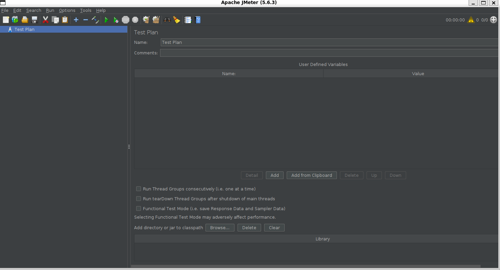

- Keep the terminal on to work with Jmeter

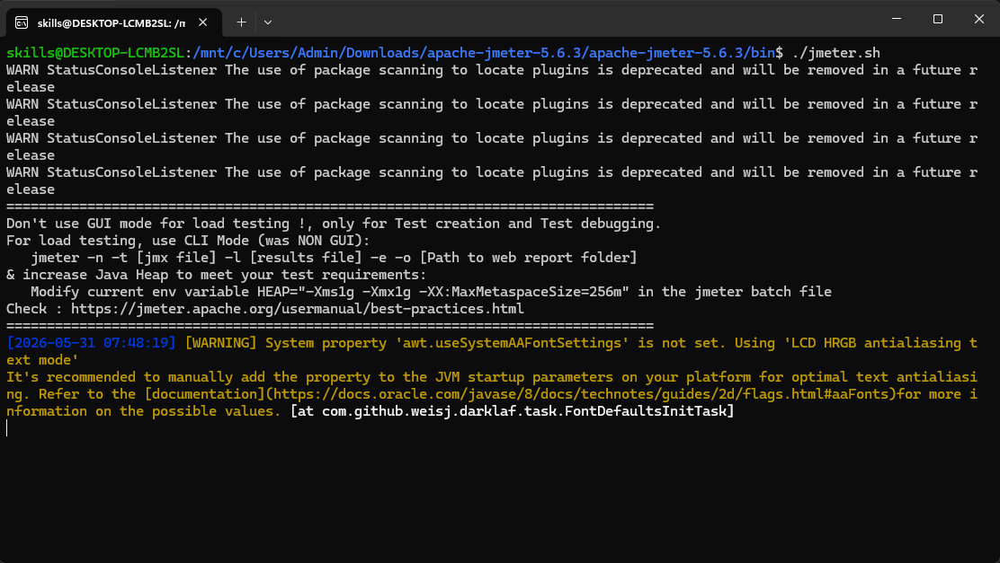

## Implement Performance Testing

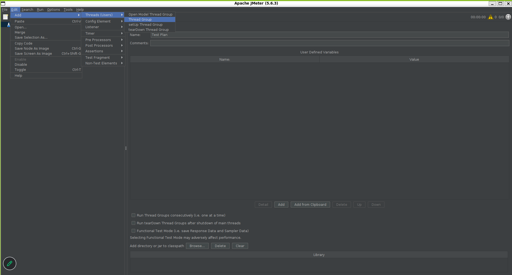

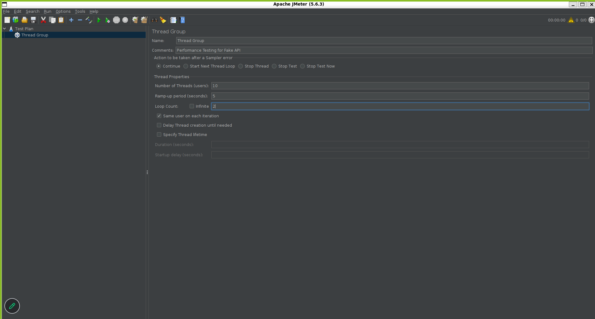

- right click on Thread Group>add>Sampler>HTTP Request

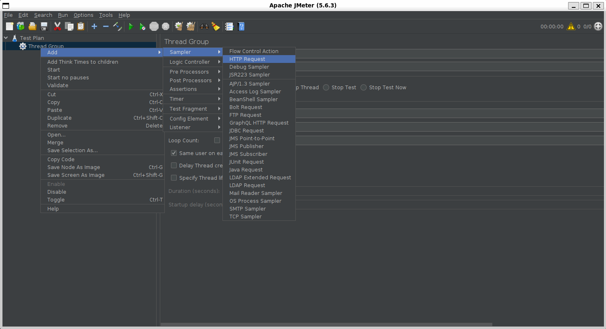

- add protocol, ip, http request, path
- url
```
https://jsonplaceholder.typicode.com/todos
```
Or
```
https://jsonplaceholder.typicode.com/todos
```
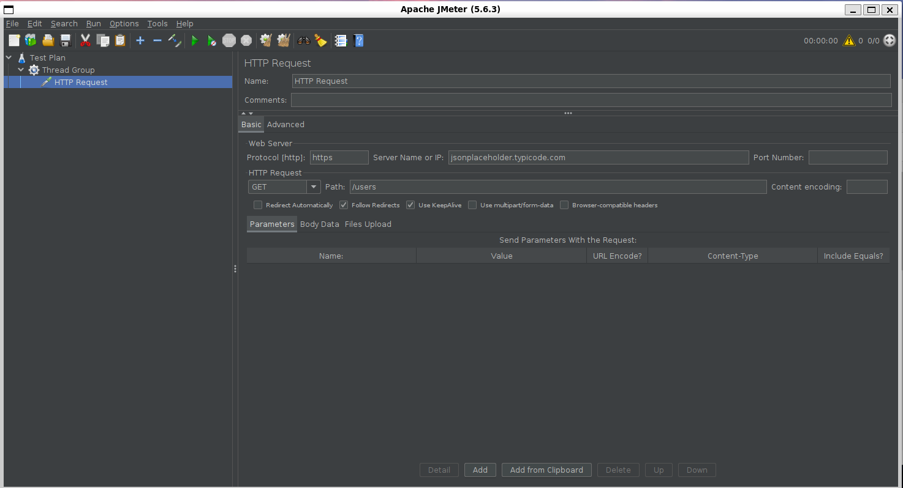

- for checking result press start icon

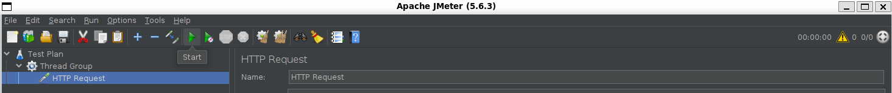

- after clicking start icon click on warnning icon
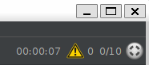

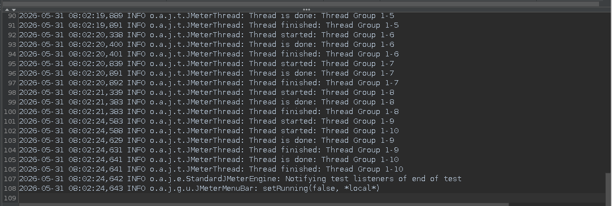

- Another way of checking result

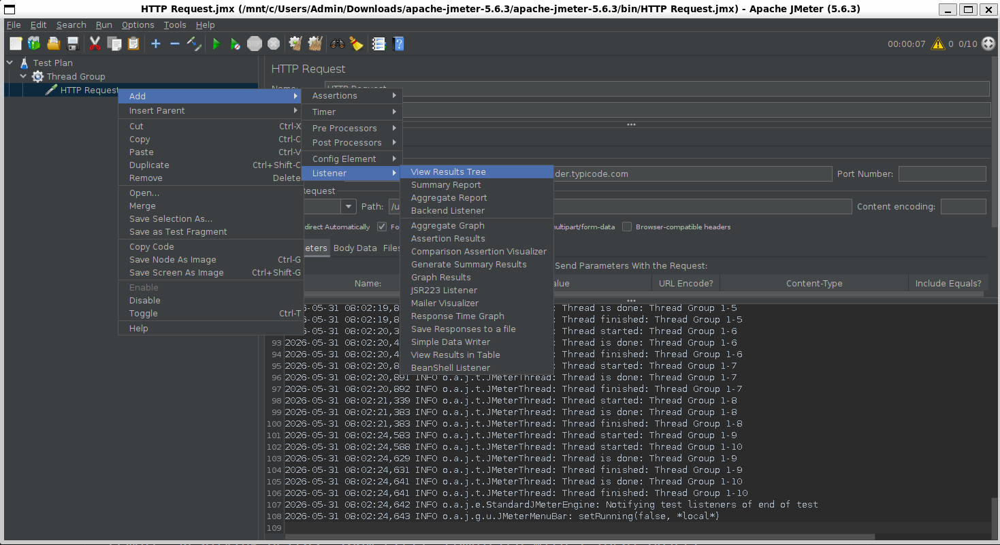

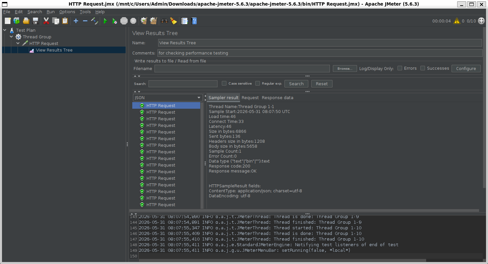
- click on start button and check result response data
- once it is generated you can save to file as well
- click on configure and browse for file name and save data

## Generate Summary Report

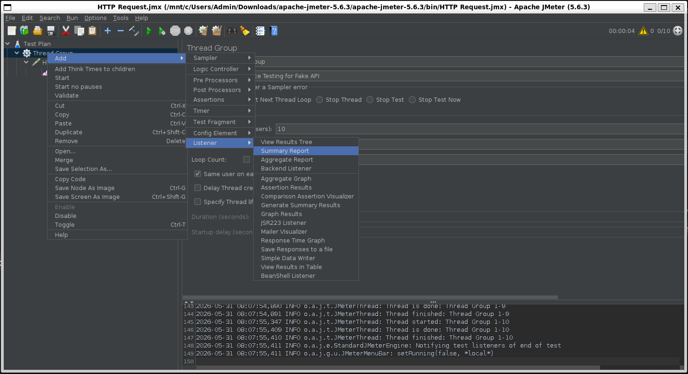

- run again and generate summary report

 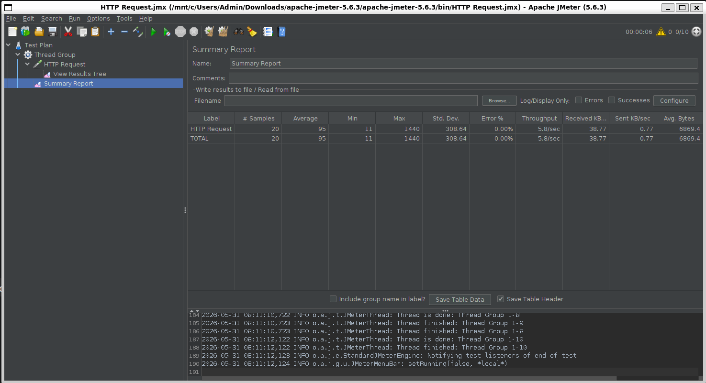