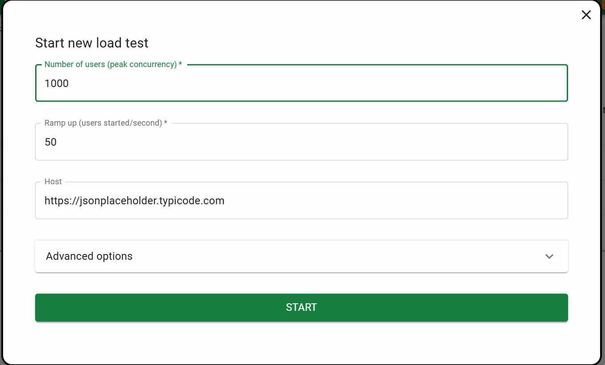
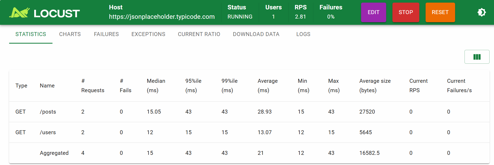
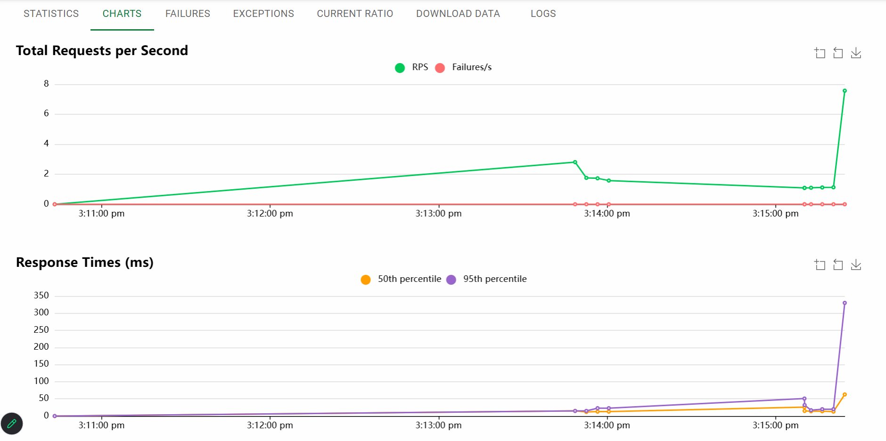

# Stress Testing
- finding out breaking point of application
- increase load along with limit (it is short time)
- finding out how system users from 1000 to 50000 until app crash

# Soak Testing
- checking stabilty over a long time
- steady step by step increase load (it is long time)
- run app with 5000 users continuosly for 48-72 hrs and monitor memory/CPU

## Setting up Locust Testing
- setting up environment for locust
```
python3 -m venv venv

source venv/bin/activate

pip install locust

locust --version

```
## Verify everything
- you will see your screen like
```
(venv) nikunj@Desktop:~/project$
```
- create locust.py file and add some code
- refer document: [text](https://pypi.org/project/locust/)
- reference code
```
from locust import HttpUser, task, between

class MyStressTestUser(HttpUser):
    wait_time = between(1, 2)

    @task
    def get_posts_users(self):
        self.client.get("/posts")
        self.client.get("/users")

```
- goto>wsl>
```
nano locustfile.py
```
- Hit Enter Button
- Paste the Reference code
- ctr +s, ctr+x
- run locust
```
locust -f locustfile.py # incase 8089 is busy use below command
locust -f locustfile.py --web-port 9090
```


- add users 1000 to see the response in better way
- click start
- check statistics



- check charts, failures, exceptions, current ratio etc...

